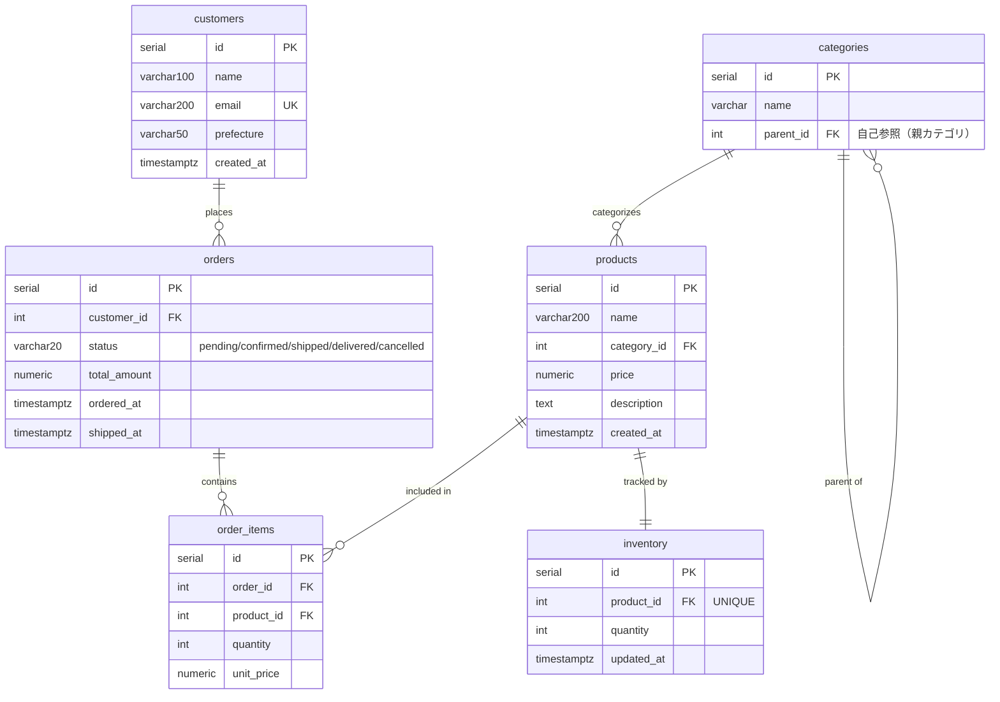

# UdeMart PostgreSQL実践講座 Vol.1 — クエリ・チューニング・トランザクション編

SELECT/CRUDの次へ。実務で使えるPostgreSQLを、ストーリー形式で身につける。

---

## このコースについて

架空のECサイト **UdeMart** のエンジニアとして、日々の業務で遭遇するリアルな問題を解決しながら、PostgreSQLの実践的なスキルを習得します。

「クエリが遅い」「データが消えた」「同時に注文が入って在庫がマイナスになった」——そんな現場のトラブルを題材に、PostgreSQLの強力な機能を実践的に学んでいきます。

---

## このコースで身につくこと

### スキル一覧

| カテゴリ | 身につくスキル |
|---|---|
| **実務SQL** | ウィンドウ関数による集計・ランキング・時系列分析・JSONBによる柔軟スキーマ設計 |
| **パフォーマンス調査** | スロークエリの特定・実行計画の読み方・ボトルネックの分析 |
| **インデックス設計** | 適切なインデックスの選定・複合インデックスの列順序・効果の測定 |
| **クエリ最適化** | EXPLAIN ANALYZEの活用・WITH句による多テーブルJOINの分割・マテリアライズドビューのキャッシュ戦略 |
| **同時実行制御** | トランザクション設計・悲観ロック・楽観ロック・デッドロックの防止 |
| **大量データ管理** | テーブルパーティショニング・パーティションプルーニングの確認・パーティションの運用 |

### 主なキーワード

`ROW_NUMBER` / `RANK` / `DENSE_RANK` / `SUM OVER` / `AVG OVER` / `LAG` / `LEAD` /
`PARTITION BY` / `ROWS BETWEEN` / `JSONB` / `->>` / `@>` / GINインデックス /
`pg_stat_activity` / `pg_stat_statements` / `EXPLAIN ANALYZE` / `Seq Scan` / `Index Scan` /
`CREATE INDEX` / 複合インデックス / `MATERIALIZED VIEW` / `WITH句（CTE）` / `MATERIALIZED` /
`BEGIN` / `COMMIT` / `ROLLBACK` / `SELECT FOR UPDATE` / 楽観ロック / デッドロック /
`PARTITION BY RANGE` / パーティションプルーニング / `DETACH PARTITION`

---

## 対象者

- SELECT / INSERT / UPDATE / DELETE の基本操作ができる
- JOIN（INNER JOIN, LEFT JOIN）が使える
- WHERE / ORDER BY / GROUP BY を理解している
- ターミナルで `cd` やコマンド実行ができる
- Docker Desktop を起動し、`docker compose up` / `docker compose down` を実行できる
- 「クエリが遅い」「データが壊れた」といった問題に対処したい
- 業務でPostgreSQLを使っており、より深く理解したい

### 受講前提

この講座はSQLの入門講座ではありません。以下の知識がある前提で進めます。

| 分野 | 前提レベル |
|---|---|
| SQL | `SELECT` / `INSERT` / `UPDATE` / `DELETE`、`WHERE`、`ORDER BY`、`GROUP BY` が分かる |
| JOIN | `INNER JOIN` と `LEFT JOIN` の基本が分かる |
| ターミナル操作 | ディレクトリ移動、コマンド実行、エラー表示の確認ができる |
| Docker | Docker Desktop を起動し、Docker Compose でコンテナを起動・停止できる |
| PostgreSQL | ローカルインストールは不要。ただし、DB・テーブル・インデックスという用語は知っている |

Docker Compose が使えるか不安な方は、購入前に `preview-docker-compose-check.md` の手順を確認してください。

---

## 章構成

| 章 | ディレクトリ | テーマ |
|---|---|---|
| 00 | chapter00-setup | セットアップ |
| 01 | chapter01-sql | 実務SQL（ウィンドウ関数・JSONB・再帰CTE・UPSERT・全文検索） |
| 02 | chapter02-tuning | パフォーマンスチューニング（スロークエリ・インデックス・マテビュー・結合アルゴリズム） |
| 03 | chapter03-transaction | トランザクション・ロック制御 |
| 04 | chapter04-partitioning | パーティショニング |
| Final | chapter99-final | コース振り返り・クリーンアップ |

---

## 受講環境

### 教材ファイルの配布方針

このリポジトリには、環境構築手順・章ごとの解説・データ投入用の `setup.sql`・セクションごとの `practice/*.sql` を置いています。

受講者はホストPCにこのリポジトリをクローンし、Docker Composeで起動した踏み台サーバーから同じ教材ファイルを参照します。教材はホストPC上に残るため、VS Code や Finder / Explorer でも確認できます。

各章は以下の構成です。

```text
chapterNN-xxx/
├── README.md        # ストーリー・解説・SQL例
├── setup.sql        # 章専用データ投入スクリプト
└── practice/        # セクションごとの実習ファイル
```

### 動作確認環境

| 項目 | 内容 |
|---|---|
| 解説者のマシン | MacBook Pro M5 無印 / メモリ 16GB |
| PostgreSQL | Docker公式イメージ `postgres:16`（検証時: PostgreSQL 16.14） |
| Docker | Docker Desktop 最新版 |
| Docker Compose | Docker Compose v2 系 |
| 踏み台サーバー | Ubuntu 22.04 ベース |
| DB メモリ制限 | 1GB（shared_buffers=256MB） |

各自のマシンスペックが異なっても同じ結果が得られるよう、**PostgreSQLのメモリ使用量を1GBに制限**しています。クエリの実行時間は環境によって差が出ますが、「速くなる / 遅くなる」という傾向は同じになります。

### 必要なソフトウェア

**Docker Desktop**（必須）

- [Mac](https://www.docker.com/products/docker-desktop/) / [Windows](https://www.docker.com/products/docker-desktop/) からダウンロード
- インストール後、Docker Desktop を起動しておく

**SSH クライアント**（必須）

このコースでは **踏み台サーバー（Ubuntu）経由でpsqlを使用**します。ローカルにpsqlをインストールする必要はありません。SSH クライアントだけあればOKです。

| OS | SSH クライアント |
|---|---|
| macOS | Terminal.app（標準搭載）を使用 |
| Windows 10 / 11 | PowerShell またはコマンドプロンプト（標準搭載）を使用 |

踏み台サーバーを使う理由：macOS / Windows の環境差異をなくし、全員が同じLinux環境でpsqlを操作するためです。これは実際の本番環境でも一般的な構成です。

**Git**（必須）

教材一式をホストPCに取得するために使用します。

| OS | Git |
|---|---|
| macOS | `git --version` で確認。未インストールの場合は画面の案内に従ってCommand Line Toolsを入れる |
| Windows 10 / 11 | [Git for Windows](https://git-scm.com/download/win) をインストール |

### Docker のディスク割り当て

大量データを生成する章（Chapter 02 など）では、PostgreSQLのデータが最大 **3〜4GB** 程度になる場合があります。

Docker Desktop のデフォルトのディスク割り当てが少ない場合、データが途中で入らなくなることがあります。

**設定確認・変更方法：**

```
Docker Desktop → Settings → Resources → Virtual disk limit
→ 最低 20GB 以上を推奨（余裕があれば 40GB）
```

Dockerイメージ（postgres:16 + Ubuntu bastion）だけで 約2〜3GB 消費するため、データ領域を含めると 20GB を確保しておくと安心です。

### psqlをローカルで使いたい場合（任意）

踏み台サーバーを使わずにローカルのpsqlでも接続できます。インストール方法は以下のとおりです。

**macOS:**
```bash
brew install libpq
echo 'export PATH="/opt/homebrew/opt/libpq/bin:$PATH"' >> ~/.zshrc
source ~/.zshrc
```

**Windows（winget）:**
```powershell
winget install PostgreSQL.psql
```

**Windows（公式インストーラー）:**
[https://www.postgresql.org/download/windows/](https://www.postgresql.org/download/windows/) からインストーラーをダウンロードし、「Command Line Tools」のみ選択してインストール。

---

## 起動前の確認：ポートの競合を防ぐ

このコースの共通DB環境は以下のポートを使用します。

| ポート | 用途 |
|---|---|
| **5432** | PostgreSQL |
| **2222** | 踏み台サーバー（SSH） |

**他のDockerコンテナや他の講座の環境がこれらのポートを使っていると起動に失敗します。**  
以下のコマンドでポートが空いているか事前に確認してください。

**macOS / Linux:**
```bash
lsof -i :5432
lsof -i :2222
```

**Windows（PowerShell / コマンドプロンプト）:**
```powershell
netstat -an | findstr "5432"
netstat -an | findstr "2222"
```

何も表示されなければOKです。出力がある場合は、使用中のコンテナを停止してから進めてください。

```bash
# 他のdocker-compose環境が動いている場合は停止する
docker compose down   # 該当のdocker-composeディレクトリで実行
```

---

## クイックスタート

ホストPCに **Docker** と **Git** が入っていれば OK です。

### 1. 教材をホストPCにクローン

任意のディレクトリで以下を実行してください。

```bash
git clone https://github.com/tripring/udemy-postgres-vol1.git
cd udemy-postgres-vol1
```

### 2. Docker で環境を起動

```bash
# 初回はbastionイメージのビルドあり・数分かかります
docker compose up -d --build

# 起動確認（udemart-db と udemart-bastion の2つが表示されればOK）
docker compose ps
```

### 3. 踏み台サーバーに SSH 接続

```bash
ssh -p 2222 student@localhost
# パスワード: student123
```

### 4. 共通スキーマを作成

SSH接続後、bastion 内で実行します。ホストPCにクローンした教材ディレクトリは、bastion 内の `~/course` として見えます。

```bash
psql -f ~/course/chapter00-setup/init.sql
```

`psql` をそのまま実行するだけで PostgreSQL に繋がります。

```bash
psql
# udemart=#  と表示されれば OK
```

---

## ファイル構成

```
udemy-postgres-vol1/
├── docker-compose.yml              # 共通DB環境（bastionサーバー含む）
├── Dockerfile.bastion              # Ubuntu 22.04 踏み台サーバー
├── preview-docker-compose-check.md # 購入前プレビュー用のDocker Compose確認手順
├── chapter00-setup/
│   └── init.sql                    # 共通スキーマ定義（テーブル作成）
├── chapter01-sql/                  # 実務SQL
├── chapter02-tuning/               # パフォーマンスチューニング
├── chapter03-transaction/
├── chapter04-partitioning/
└── chapter99-final/                # コース修了・振り返り・クリーンアップ手順
```

各章のディレクトリ構成:

```
chapterNN-xxx/
├── README.md        # ストーリー・解説・SQL例
├── setup.sql        # 章専用データ投入スクリプト
└── practice/        # セクションごとの実習ファイル
    ├── 01_xxxx.sql
    ├── 02_xxxx.sql
    └── ...
```

---

## 各章の進め方

1. bastion にSSH接続する
2. 各章の `setup.sql` を実行して事前データを投入する
3. `practice/` ディレクトリのファイルを順番に実行する

```bash
# 踏み台サーバー内での実行例（Chapter 02）
psql -f ~/course/chapter02-tuning/setup.sql
psql -f ~/course/chapter02-tuning/practice/01_pg_stat_activity.sql
```

章をまたぐたびに `setup.sql` を実行することで、前の章のデータに影響されずに学習できます。

---

## UdeMartのデータモデル

全章を通じて使用するECサイトのスキーマです。



詳細は `chapter00-setup/init.sql` を参照してください。

---

## 環境のクリーンアップ（早見表）

詳細は `chapter99-final/README.md` を参照してください。

```bash
# 共通DB環境を停止・削除（データも消す場合）
docker compose down -v

# イメージごと削除してディスクを解放したい場合は --rmi all を追加
docker compose down -v --rmi all
```

---

## コース修了後に身につく技術の全体像

| チャプター | テーマ | 身についた核心スキル |
|---|---|---|
| 01 | 実務SQL | ウィンドウ関数・JSONB・再帰CTE・UPSERT・全文検索 |
| 02 | クエリチューニング | EXPLAIN ANALYZE・インデックス設計・結合アルゴリズム・キーセットページネーション |
| 03 | トランザクション | ACID特性・ロック戦略・デッドロック対処・ロック調査 |
| 04 | パーティショニング | 今日データの分割管理とプルーニング |

---

## Vol.2 について

本コースの続編として Vol.2（運用・インフラ設計編）があります。トリガー・バックアップ・レプリケーション・VACUUM・PgBouncer・監査ログを扱います。
