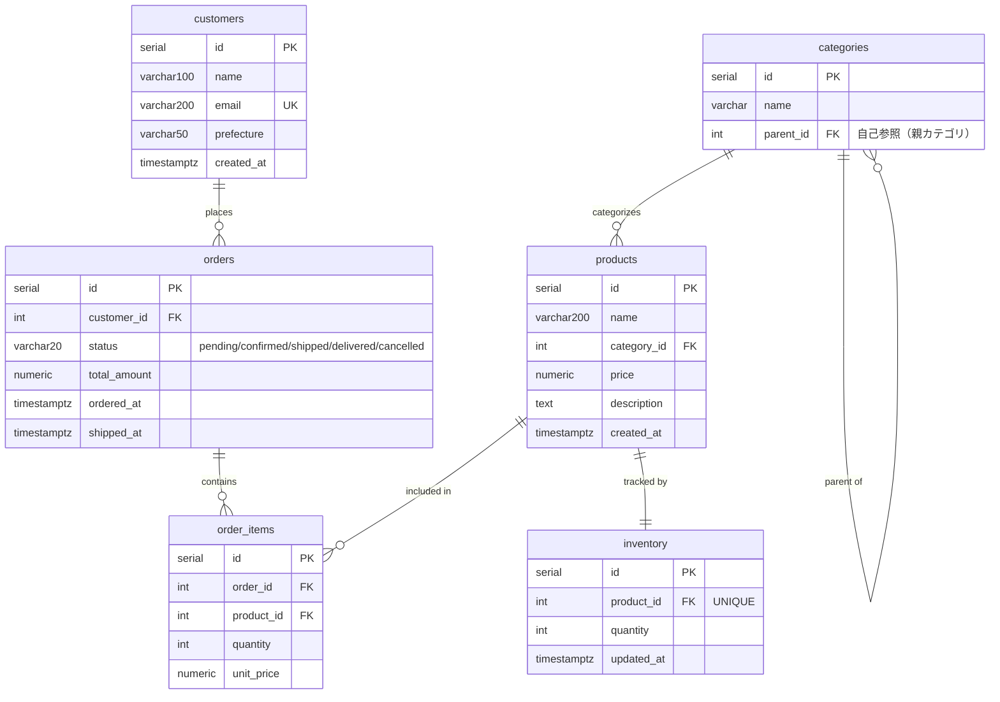

# Chapter 00: セットアップ

## このチャプターで行うこと

- Docker Composeを使ってPostgreSQL環境と踏み台サーバーを構築する
- 直接接続 / 踏み台サーバー経由の2通りでDBに接続する
- UdeMartのスキーマ（テーブル構成）を確認する

---

## 環境の全体像

```
あなたのPC（Windows / Mac）
    │
    ├─── 直接接続 (port 5432) ────────────────────────► udemart-db（PostgreSQL）
    │
    └─── SSH (port 2222) ──► udemart-bastion（Ubuntu）──► udemart-db（PostgreSQL）
                              ※ 本番環境に近いリアルな構成
```

2つの接続方法を両方体験できます。

---

## 前提：他のコンテナを停止してから始める

このコースの環境はポート **5432**（PostgreSQL）と **2222**（SSH）を使用します。  
**他のDockerコンテナがすでに起動している場合は、先に停止してください。** ポートが競合して起動に失敗します。

```bash
# 他の講座などでdocker-composeを使っている場合は、そのディレクトリで停止する
docker compose down
```

ポートが空いているか確認したい場合：

```bash
# macOS / Linux
lsof -i :5432
lsof -i :2222

# Windows（PowerShell）
netstat -an | findstr "5432"
netstat -an | findstr "2222"
```

何も表示されなければOKです。

---

## 1. Docker Composeの起動

ホストPCでこのリポジトリをクローンし、リポジトリ直下で実行します。

```bash
# udemy-postgres-vol1 ディレクトリで実行
cd udemy-postgres-vol1
docker compose up -d --build
```

初回は `udemart-bastion` のDockerイメージをビルドするため数分かかります。

起動確認：

```bash
docker compose ps
```

以下のように2コンテナが `running` と表示されればOKです。

```
NAME               IMAGE         STATUS
udemart-bastion    ...           Up
udemart-db         postgres:16   Up
```

---

## 2-A. 直接接続（ローカルから psql）

ローカルにpsqlがインストールされている場合はそのまま接続できます。

```bash
psql -h localhost -U udemart -d udemart
```

パスワードを聞かれたら `udemart123` と入力してください。

```
udemart=#
```

---

## 2-B. 踏み台サーバー経由で接続する（本番環境に近い構成）

実際の本番環境では、PostgreSQLは外部から直接アクセスできないことが多く、
**踏み台サーバー（Bastion Host）** を経由して接続します。

### Step 1: bastionサーバーにSSH接続

```bash
ssh student@localhost -p 2222
```

パスワード: `student123`

接続すると以下のメッセージが表示されます：

```
✔ UdeMart Bastion Server
  PostgreSQL: psql で接続できます
  接続先: udemart-db:5432/udemart

student@xxxxxxxx:~$
```

### Step 2: bastionからpsqlで接続

```bash
# 環境変数が設定済みなのでそのまま実行できます
psql
```

または明示的に指定する場合：

```bash
psql -h udemart-db -U udemart -d udemart
```

パスワード不要（`.pgpass` ファイルで設定済み）で接続できます。

```
udemart=#
```

### Step 3: bastionからinit.sql / setup.sqlを実行する

ホストPCにクローンした教材ディレクトリは、bastion内でも同じ名前の `~/udemy-postgres-vol1/` にマウントされています。

```bash
# まず共通スキーマを作成
psql -f ~/udemy-postgres-vol1/chapter00-setup/init.sql

# 例: Chapter 01のsetup.sqlを実行
psql -f ~/udemy-postgres-vol1/chapter01-sql/setup.sql

# ファイル一覧を確認したい場合
ls ~/udemy-postgres-vol1/
```

psqlを開いたまま別のSQLファイルを実行したい場合は `\i` コマンドが使えます。

```sql
-- psql内から実行する場合
\i /home/student/udemy-postgres-vol1/chapter01-sql/setup.sql
```

### SSHトンネリング（GUIツールを使いたい場合）

DBeaver・TablePlusなどのGUIクライアントからbastionを経由して接続したい場合は、SSHトンネルを張ります。

```bash
# ローカルの15432番ポートをDB（udemart-db:5432）にトンネル
ssh -L 15432:udemart-db:5432 student@localhost -p 2222 -N
```

別ターミナルで維持しながら、GUIツールで `localhost:15432` に接続してください。

---

## 3. よく使うpsqlコマンド

psqlはコマンドラインのPostgreSQLクライアントです。SQLの実行に加えて、以下のメタコマンドを覚えておきましょう。

| コマンド | 説明 |
|---------|------|
| `\l` | データベース一覧を表示 |
| `\dt` | テーブル一覧を表示 |
| `\d テーブル名` | テーブルの定義を表示 |
| `\timing` | クエリの実行時間を表示（トグル） |
| `\x` | 結果を縦表示にする（トグル） |
| `\q` | psqlを終了 |

---

## 4. UdeMartのスキーマを確認する

psqlに接続した状態で以下を実行してください。

```sql
-- テーブル一覧の確認
\dt

-- 各テーブルの定義を確認
\d customers
\d categories
\d products
\d orders
\d order_items
\d inventory
```

---

## 5. UdeMartのデータモデル



### テーブル概要

| テーブル | 説明 |
|---------|------|
| **customers** | 顧客。email は一意 |
| **categories** | カテゴリ。parent_id で階層構造（自己参照） |
| **products** | 商品。category_id で categories に紐づく |
| **orders** | 注文ヘッダ。status は `pending` → `confirmed` → `shipped` → `delivered`（または `cancelled`） |
| **order_items** | 注文明細。1注文に1件以上存在 |
| **inventory** | 在庫。product_id は一意（1商品1レコード） |

---

## 6. 環境のリセット方法

誤って大量のデータを入れてしまった場合など、環境をリセットするには以下を実行します。

```bash
# コンテナとボリュームを削除してリセット
docker compose down -v

# 再起動
docker compose up -d --build

# bastionにSSH接続し、共通スキーマを作成し直す
psql -f ~/udemy-postgres-vol1/chapter00-setup/init.sql
```

---

## 次のチャプターへ

セットアップが完了したら、Chapter 01「実務SQL」に進みましょう。

```bash
# setup.sqlでデータを投入
psql -f ~/udemy-postgres-vol1/chapter01-sql/setup.sql
```
